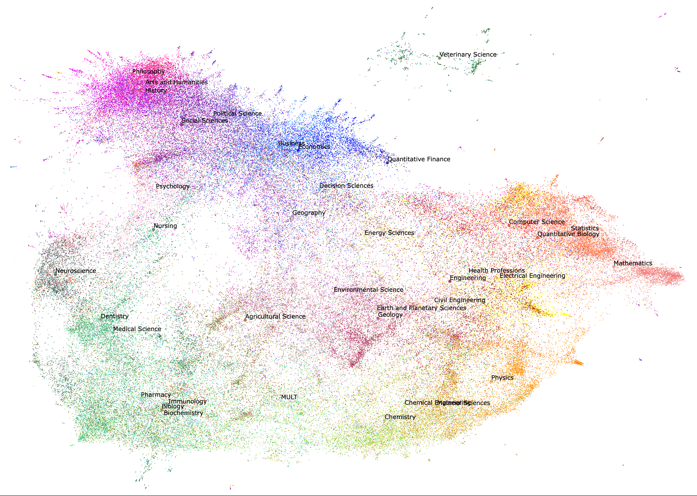
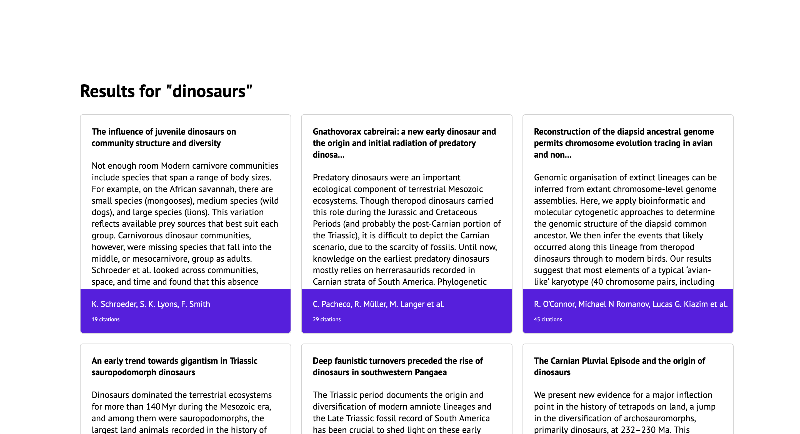
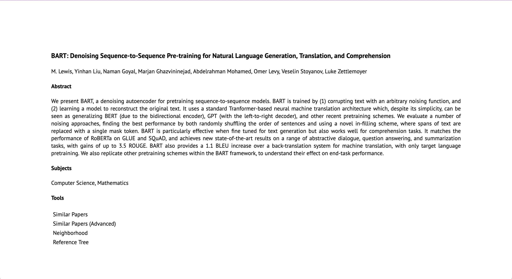
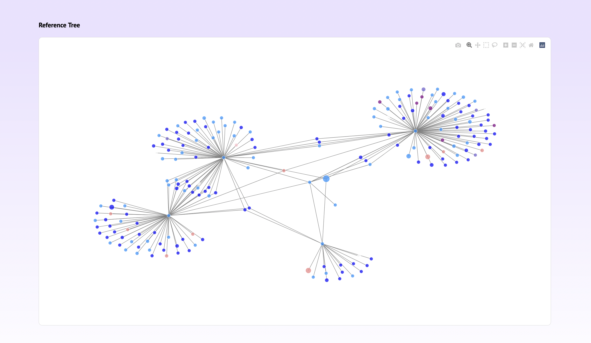

# RecommendingPapers

This repository is part of a project that was conducted at the **Professorship of Economics of Innovation**  at the **Technical University of Munich**. A team of two was working on this project during a 3-month period. The project's main building blocks are: 

1. A Python backend that implements several natural language processing techniques in the context of recommending research papers
2. A Javascript frontend that wraps the backend's functionality into a user-friendly web app.

The recommender system is based on comparing high dimensional embeddings of research papers using the cosine distance. Low dimensional representations of these embeddings that were obtained by applying Uniform Manifold Approimation and Projection (UMAP) are shown in the following. The visualization depicts 141.256 paper embeddings projected from a 200 dimensional space into 2 dimensions. Papers are colored by their subject. The coloring was performed manually and is based on the perceived distance of subjects.

<br>

<p align="left">
    
</p>

## Application

A short glimpse on a subset of the applications functionalities is given in the following pictures.

<p align="left">
    
</p>

In this case the results of the custom search query "**dinosaurs**" are presented and the user can choose one of the research papers to continue exploring. 

<p align="left">
    
</p>

Once a paper was chosen, more details regarding the selected paper will be presented. In this example the "**BART [...]**" paper was chosen. This view offers several further possibilities for exploration. One of the listed tools can be used to recommend similar papers, where every tool defines the similarity of papers differently. 

<p align="left">
    
</p>

The picture above displays the recommendations provided by the "**Similar Papers**" functionality that ranks papers according to their cosine distance to the query paper.

<p align="left">
    
</p>

As an alternative a papers reference tree can be displayed. Here, a depth of two was chosen for to ensure a clean visualization. 

<br>

## Setup
The provided *src/setup.ipynb* can be run to install all packages and to setup the database. Before running *src/setup.ipynb* the respective datasets should be downloaded and should be put into their respective directories as indicated in *src/utils/constants.py*.

<br>

## Data
The project relies on several data sources that are not included in this repository for licensing reasons. The datasets used during the project are the following ones: 

1. The Semantic Scholar Open Research Corpus(136 million papers) [1]
2. Two ArXiv Datasets (1.7 million papers combined) [2,3]
3. Three Kaggle Topic Modelling Datasets (120,000 papers combined) [4,5,6]
4. The Elsevier Open Journals Dataset (40,000 papers) [7]
5. The Web of Science (WoS) Dataset (46,985 papers) [8]

<br>

## License
This project is not publicly licensed and any work that builds on it has to obtain approval by the project's authors.

<br>

## References: 
```
[1] 
@inproceedings{s2orc,
    title = "{S}2{ORC}: The Semantic Scholar Open Research Corpus",
    author = "Lo, Kyle  and Wang, Lucy Lu  and Neumann, Mark  and Kinney, Rodney  and Weld, Daniel",
    booktitle = "Proceedings of the 58th Annual Meeting of the Association for Computational Linguistics",
    month = jul,
    year = "2020",
    address = "Online",
    publisher = "Association for Computational Linguistics",
    url = "https://www.aclweb.org/anthology/2020.acl-main.447",
    doi = "10.18653/v1/2020.acl-main.447",
    pages = "4969--4983"
}

[2] 
@online{kagglearxiv,
    title = {arXiv Paper Abstracts}, 
    author = {Sayak},
    year = 2021,
    url = {https://www.kaggle.com/datasets/spsayakpaul/arxiv-paper-abstracts?select=arxiv_data_210930-054931.csv},
    urldate = {2022-04-29},
    note = {. Last accessed: 29 Apr 2022, 20:44}
}

[3] 
@online{arxiv,
    title = {arXiv Dataset}, 
    author = {Cornell University},
    year = 2022,
    url = {https://www.kaggle.com/datasets/Cornell-University/arxiv},
    urldate = {2022-03-14},
    note = {. Last accessed: 29 Apr 2022, 20:47}
}

[4] 
@online{kaggle1,
    title = {Research Paper Abstracts}, 
    author = {Nikhil Mittal},
    year = 2019,
    url = {https://www.kaggle.com/datasets/nikhilmittal/research-paper-abstracts},
    urldate = {2022-04-29},
    note = {. Last accessed: 29 Apr 2022, 20:40}
}

[5] 
@online{kaggle2,
    title = {Topic Modeling for Research Articles}, 
    author = {Blesson Densil},
    year = 2020,
    url = {https://www.kaggle.com/datasets/blessondensil294/topic-modeling-for-research-articles},
    urldate = {2022-04-29},
    note = {. Last accessed: 29 Apr 2022, 20:42}
}

[6] 
@online{kaggle3,
    title = {Topic Modeling for Research Articles}, 
    author = {Abishek Sudarshan},
    year = 2022,
    url = {https://www.kaggle.com/datasets/abisheksudarshan/topic-modeling-for-research-articles},
    urldate = {2022-04-29},
    note = {. Last accessed: 29 Apr 2022, 20:44}
}

[7] 
@online{elsevier,
    title = {Elsevier OA CC-BY Corpus V3}, 
    author = {Daniel Kershaw and Rob Koeling},
    year = 2020,
    doi = {10.17632/zm33cdndxs.3},
    url = {https://www.kaggle.com/datasets/Cornell-University/arxiv},
    urldate = {2022-03-14},
    publisher = "Mendeley",
    note = {. Last accessed: 29 Apr 2022, 20:52}
}

[8]
@online{wos,
    title = {Web of Science Dataset V6}, 
    author = {Kamran Kowsari and Donald Brown and Mojtaba Heidarysafa and Kiana Jafari Meimandi and Matthew Gerber and Laura Barnes},
    year = 2018,
    doi = {10.17632/9rw3vkcfy4.6},
    url = {https://data.mendeley.com/datasets/9rw3vkcfy4/6},
    urldate = {2022-04-28},
    publisher = "Mendeley Data",
    note = {. Last accessed: 29 Apr 2022, 20:55}
}
```